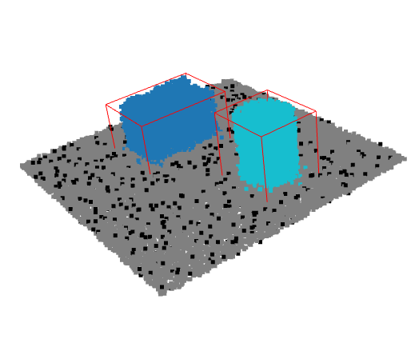

# 3D Point Cloud Segmentation & Bounding Box Extraction

This project demonstrates a classic computer vision pipeline for processing 3D point clouds. The script generates a synthetic scene (a tabletop with parts) and applies machine vision algorithms to isolate objects, calculate their centroids, and construct precise bounding boxes for potential grasping by a robotic manipulator.

## 🚀 Pipeline Features

1. **Data Generation:** Creates a synthetic 3D point cloud (table, box, cylinder) simulating standard sensor noise.
2. **Plane Segmentation (RANSAC):** Mathematically identifies and removes the main supporting plane (the table) to isolate the target parts.
3. **Clustering (DBSCAN):** Divides the remaining points into independent objects based on spatial density. Filters out optical noise (outliers).
4. **Spatial Analysis:** Calculates exact centroid coordinates for each detected object.
5. **Bounding Box Generation:** Constructs Axis-Aligned Bounding Boxes (AABB) for each cluster to define physical dimensions.

## 🛠 Installation & Usage

The project is written in Python. Setting up the environment on Linux takes just a few commands.

First, ensure your package manager is up to date, then install the required libraries:

```bash
sudo apt update
sudo apt install python3-pip
pip3 install open3d numpy matplotlib